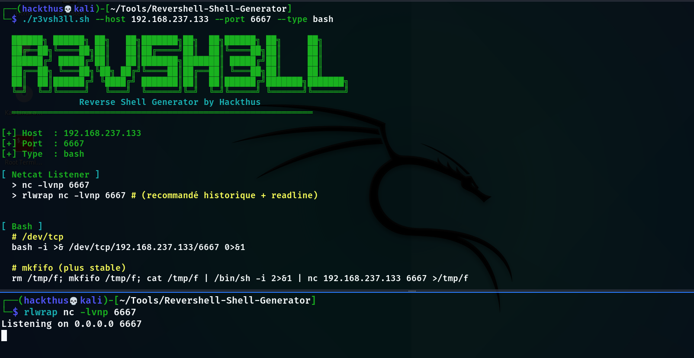
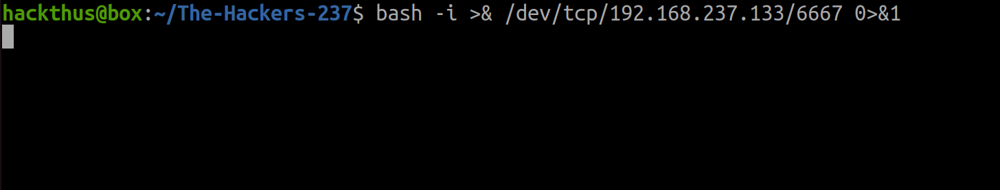
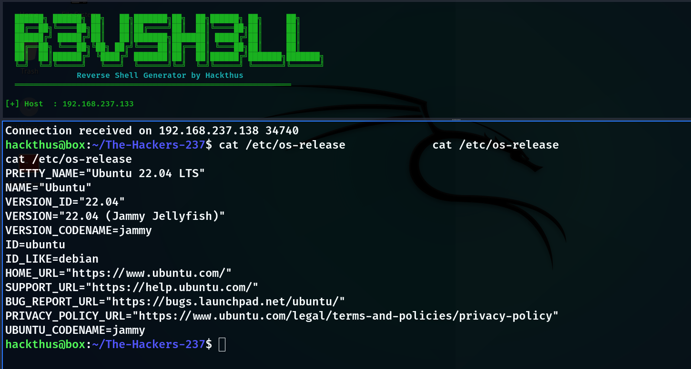

#  Reverse Shell Generator

Un script Bash simple et efficace pour générer rapidement des **reverse shells** dans différents langages lors de laboratoires et CTF (Tryhackme, HTB, etc..).

---

##  Fonctionnalités

* Génération de reverse shells :

  - PowerShell (encodé Base64)
  - Bash
  - Python (2 & 3)
  - Netcat
* Affichage automatique d’un **listener Netcat**
* Validation des entrées :

  - Adresse IP
  - Port
* Interface CLI claire avec couleurs
* Vérification des dépendances
* Mode `all` pour afficher tous les payloads

---

##  Installation

Clone le dépôt :

```bash
git clone https://github.com/hackthus/Revershell-Shell-Generator.git
cd Revershell-Shell-Generator
chmod +x r3vsh3ll.sh
```

---

## Installation automatique (recommandée)

```bash
chmod +x install.sh
./install.sh
```

##  Dépendances

les fonctionnalités nécessitent :

- `nc` (netcat)
- `rlwrap` (optionnel mais recommandé)
- `iconv` (pour PowerShell)
- `base64` (pour PowerShell)

Le script affiche un warning si certaines dépendances sont manquantes.

##  Utilisation

```bash
./r3vsh3ll.sh --host <IP> --port <PORT> [--type TYPE]
```

### Arguments

| Option   | Description                 |
| -------- | --------------------------- |
| `--host` | IP de l’attaquant           |
| `--port` | Port d’écoute               |
| `--type` | Type de payload (optionnel) |

### Types disponibles

* `powershell` (défaut)
* `bash`
* `python`
* `nc`
* `all`

---

##  Exemples

### Reverse shell PowerShell (défaut)

```bash
./r3vsh3ll.sh --host 10.10.14.5 --port 4444
```

---

### Reverse shell Bash

```bash
./r3vsh3ll.sh --host 10.10.14.5 --port 4444 --type bash
```

---

### Tous les payloads

```bash
./r3vsh3ll.sh --host 10.10.14.5 --port 4444 --type all
```

---

##  Output

Le script affiche :

* Les informations de connexion
* La commande **Netcat listener**
* Le(s) payload(s) prêt(s) à l’emploi

Exemple :
```bash
./r3vsh3ll.sh --host 192.168.237.133 --port 6667 --type bash
```
Démarrage du script et mise en écoute



Exécution du payload sur la cible



Récupération de la connection (revershell)


---

## ⚠️ Avertissement

Ce projet est destiné uniquement à :

* des **tests de sécurité autorisés**
* des environnements de **lab / CTF**

 Toute utilisation non autorisée est illégale.


##  Auteur

**Hackthus**

---


