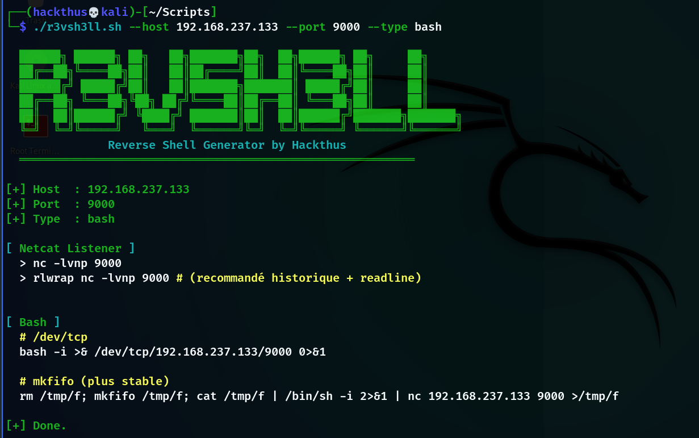

#  Reverse Shell Generator

Un script Bash simple et efficace pour générer rapidement des **reverse shells** dans différents langages lors de tests d’intrusion ou de laboratoires (CTF, HTB, etc.).

---

##  Fonctionnalités

* Génération de reverse shells :

  * PowerShell (encodé Base64)
  * Bash
  * Python (2 & 3)
  * Netcat
* Affichage automatique d’un **listener Netcat**
* Validation des entrées :

  * Adresse IP
  * Port
* Interface CLI claire avec couleurs
* Vérification des dépendances
* Mode `all` pour afficher tous les payloads

---

##  Installation

Clone le dépôt :

```bash
git clone https://github.com/hackthus/reverse-shell-generator.git
cd reverse-shell-generator
chmod +x r3v3rsh3ll.sh
```
---

##  Dépendances

les fonctionnalités nécessitent :

* `nc` (netcat)
* `rlwrap` (optionnel mais recommandé)
* `iconv` (pour PowerShell)
* `base64` (pour PowerShell)

Le script affiche un warning si certaines dépendances sont manquantes.

##  Utilisation

```bash
./r3v3rsh3ll.sh --host <IP> --port <PORT> [--type TYPE]
```

### Arguments

| Option   | Description                 |
| -------- | --------------------------- |
| `--host` | IP de l’attaquant           |
| `--port` | Port d’écoute               |
| `--type` | Type de payload (optionnel) |

### Types disponibles

* `powershell` (défaut)
* `bash`
* `python`
* `nc`
* `all`

---

##  Exemples

### Reverse shell PowerShell (défaut)

```bash
./r3v3rsh3ll.sh --host 10.10.14.5 --port 4444
```

---

### Reverse shell Bash

```bash
./r3v3rsh3ll.sh --host 10.10.14.5 --port 4444 --type bash
```

---

### Tous les payloads

```bash
./r3v3rsh3ll.sh --host 10.10.14.5 --port 4444 --type all
```

---

##  Output

Le script affiche :

* Les informations de connexion
* La commande **Netcat listener**
* Le(s) payload(s) prêt(s) à l’emploi

Exemple :




---

## ⚠️ Avertissement

Ce projet est destiné uniquement à :

* des **tests de sécurité autorisés**
* des environnements de **lab / CTF**

 Toute utilisation non autorisée est illégale.

---

##  Détails techniques

### PowerShell

* Encodage en **Base64 UTF-16LE**
* Compatible avec `powershell -enc`

### Bash

* Méthodes :

  * `/dev/tcp`
  * `mkfifo` (plus stable)

### Python

* Support Python 2 et 3
* Utilisation de `pty.spawn` pour un shell interactif

### Netcat

* Version avec `-e`
* Fallback universel avec `mkfifo`


---

##  Auteur

**Hackthus**


